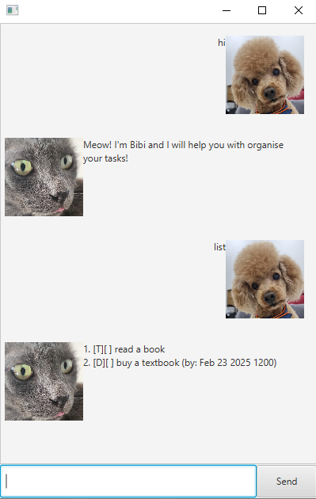

# Bibi's User Guide 🐾

Meow! I'm Bibi, your friendly task manager! Here's what I can do for you, and don't worry - I make sure everything is purr-fect! 🐱

## Commands I Can Help With:
1. List: I'll fetch your to-do-list, neatly numbered for you. Just say, ```list```.
   
2. Mark: Got a task done? Tell me to mark it with ```mark [task number]``` and I'll give it a tick.
   
3. Unmark: Oops, changed your mind? Say ```unmark [task number]``` and I'll undo it.
   
4. Delete: Time to clear things out? Tell me ```delete [task number]``` and I'll remove the task with one paw flick.
   
5. Find: Need something specific? Say ```find [keyword]``` and I'll fetch all the tasks with that word.
   
6. Todo: Have a new task? Just tell me ```todo [task]``` and I'll add it to your list.
    
7. Deadline: Got a task with a deadline? Tell me ```deadline [task] /by [date yyyy-mm-dd HHmm]``` and I'll set it so you won't forget.

8. Event: Planning an event? Tell me ```event [task] /from [date yyyy-mm-dd HHmm] /to [date yyyy-mm-dd HHmm]``` and I'll add it to your calendar.

9. Snooze: Need more time? Tell me ```snooze [task number] [number] hour/day``` and I'll give you a little extra snooze time.
    
10. Commands: Did you forget all the features? Don't worry, I got you! Just say, ```commands```.
    
